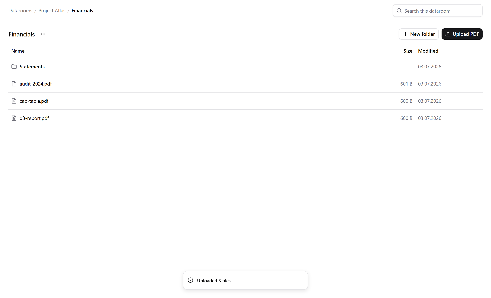

# Data Room

A client-only SPA for organizing due-diligence documents — datarooms, nested
folders, and PDF files with an in-app preview. Everything persists in the
browser (IndexedDB) and survives reload. No backend, no auth: deliberately out
of scope for this MVP.



> **Live demo:** _add the Vercel URL after deploying._

## Run it

```bash
npm install
npm run dev        # http://localhost:5173
npm run build      # typecheck (tsc -b) + production build
npx vitest run     # unit + API tests
npm run smoke      # headless end-to-end smoke test (needs the dev server running)
```

## Stack

Vite · React 19 · TypeScript (strict) · Tailwind v4 · shadcn/ui · TanStack Query
v5 · react-router v7 · idb (IndexedDB) · Vitest + fake-indexeddb.

## What it does

- **Datarooms** — one per transaction, created/renamed/deleted from the home
  screen. Delete cascades over everything inside, with the count shown up front
  and a 5-second Undo.
- **Folders** — nested to any depth. Breadcrumbs show the full path and collapse
  the middle into a `…` menu when deep.
- **Files** — PDF only, uploaded by button or drag-and-drop (multiple at once).
  Invalid files are rejected per-file with a reason; the rest still upload. Name
  clashes on upload auto-resolve Drive-style (`report (1).pdf`). Click a file to
  preview it in a resizable pane whose width persists across sessions.
- **Search** — case-insensitive substring match, scoped to the current
  dataroom; results show each hit's path and navigate on click.
- **Resilience** — reload loses nothing; a deep link to a deleted folder shows a
  friendly dead-end; deleting the folder you're standing in walks you up to its
  parent; every mutation shows pending state and surfaces failures as toasts.

See [`docs/SPEC.md`](docs/SPEC.md) for the full acceptance criteria.

## Architecture

Four layers, each only allowed to know about the one below it. Swapping to a
real backend means rewriting exactly one file (`src/api/dataroom.ts`).

```
pages/            route components — render query state, fire mutations
  └─ hooks/use-dataroom.ts   TanStack Query wrappers; owns query keys + invalidation
       └─ api/dataroom.ts    the "server": async fns + simulated latency; only module touching the DB
            └─ lib/db.ts      IndexedDB schema (idb): `nodes` = metadata, `blobs` = PDF bytes
```

Domain model (`src/types.ts`) is a **single flat store of nodes**; hierarchy is
expressed only through `parentId`, with a `ROOT` sentinel at the top. This makes
rename an O(1) update, children a single indexed lookup, and cascade delete an
iterative subtree collect — and it serializes trivially to a future SQL table.

## Design decisions

- **Flat node store over a nested tree.** A nested object would make every
  rename a deep mutation and every "children of X" a traversal. A flat store
  keyed by id, indexed by `parentId`, keeps each operation local and cheap, and
  mirrors how a real backend would model it (rows + a foreign key).
- **A hard API seam with simulated latency.** The `api/` layer is the only code
  that touches IndexedDB, and every call is async with an artificial delay. That
  forces the UI to handle loading and error states honestly instead of assuming
  instant, always-succeeding reads — so the "swap in a real server" story is
  real, not aspirational.
- **Soft delete + Undo, purge later.** Delete sets a `deletedAt` tombstone on
  the whole subtree and schedules a purge behind a 5s Undo window. A startup
  sweep (`purgeExpired`) is the safety net if the tab dies mid-window. Restore
  must therefore precede purge — modeled explicitly rather than relying on luck.
- **Two conflict policies, on purpose.** Explicit create/rename **rejects** a
  duplicate name inline (the user typed it deliberately). Upload **auto-renames**
  (`report (1).pdf`) — interrupting a drag-and-drop of ten files with ten
  dialogs would be hostile, and a rename is one click away.
- **Errors are codes, not strings.** The API throws `ApiError` with a stable
  code; the UI maps codes to copy. No raw error text leaks into the interface.
- **Legal-grade minimalism.** White, zinc grays, 1px borders, a single accent —
  the visual language of Harvey/Linear. shadcn/ui primitives, no decorative
  color, no half-built features.

## Working with AI

This project was built AI-assisted, spec-first and in layers:

1. **Spec before code.** The acceptance criteria in `docs/SPEC.md` and the
   architecture contract in `CLAUDE.md` were written first and used as the
   source of truth the agent had to satisfy — including the domain invariants
   (flat store, sibling-name uniqueness, cascade/undo) that are easy to get
   subtly wrong.
2. **Walking skeleton, then polish.** First a deliberately unstyled end-to-end
   slice (routing + query hooks + IndexedDB) proved the data flow; the polish
   pass then replaced `window.prompt/confirm/alert` and the fixed-width preview
   with shadcn `Dialog`/`AlertDialog`, `sonner` toasts, drag-and-drop, and a
   resizable split — behavior was already final, only presentation changed.
3. **Invariants are pinned by tests.** Pure logic (`lib/names.ts`) and API
   behavior (`api/dataroom.ts`) are covered against `fake-indexeddb`; new
   behavior (e.g. the pre-delete descendant count) ships with its test. The
   agent was kept honest by `npm run build` and `npx vitest run` staying green.

## What I'd build next

- **Real backend.** Replace `api/dataroom.ts` with HTTP calls (Postgres for
  metadata, object storage for blobs) — the seam already exists.
- **Auth, sharing & permissions.** Per-dataroom access, viewer/editor roles,
  audit log — table stakes for an actual data room.
- **Move nodes.** Drag-to-move between folders (the flat store makes this a
  single `parentId` update with a conflict check).
- **Optimistic mutations** for create/rename/delete to hide the network round
  trip.
- **Richer files.** Non-PDF previews, versioning, full-text search inside
  documents.
